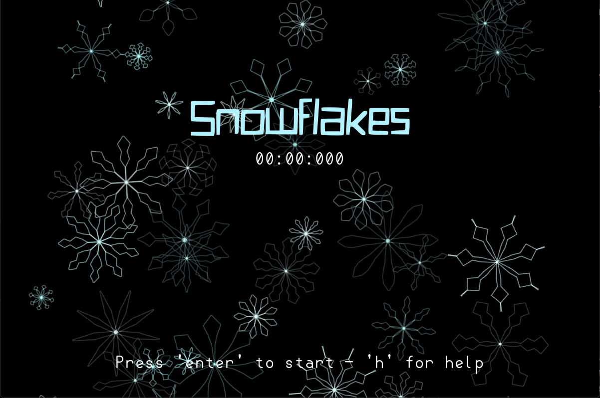

 

Snowflakes is a memory game, where you need to remember the very similar looking snowflakes and match them with their exact duplicates. The snowflakes are generating completely random (which was very hard to implement), so there is a chance that some will look similar, but aren't the same. 

 

 

# Controls
- Mouse - reveal the tiles
## Menu
- Enter - start the game
- H - help menu

## Other 
- F5 - Debug informations (may reduce FPS!)

# Features
- Random snowflake shapes
- Relaxing menu background
- Memory game
- No textures, everything is drawn from lines

# Run
- Play the game on https://snowflakes.jamedev.top 
- Download the executeables from the latest release (Windows)
- Download the .love file from the latest release and run via love (System independet)
- Build it yourself 

# Development
This game was made using 
- Lua 5.4.8
- Love2D 11.5

# Commits
This Github project uses Conventional Commits. I would recommend installing the following extension: 
[Conventional Commits](https://marketplace.visualstudio.com/items?itemName=vivaxy.vscode-conventional-commits)

# License
This project is published under the [MIT LICENSE](LICENSE)

# Other
Please note, that some of the complicated math stuff was partially generated by a LLM. 

This project is made for hackclubs siege event main week 9 (week 13 total)

 

